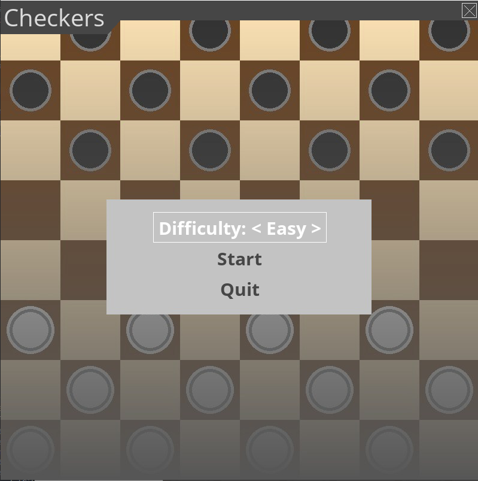

# checkers-pygame

Simple checkers pygame.

##Features:
- Play against the computer in 3 different difficulties
> It uses the MiniMax algorithm to determine the moves for the computer. Higher difficulties use more depth in the search of the algorithm
- Play local multiplayer

